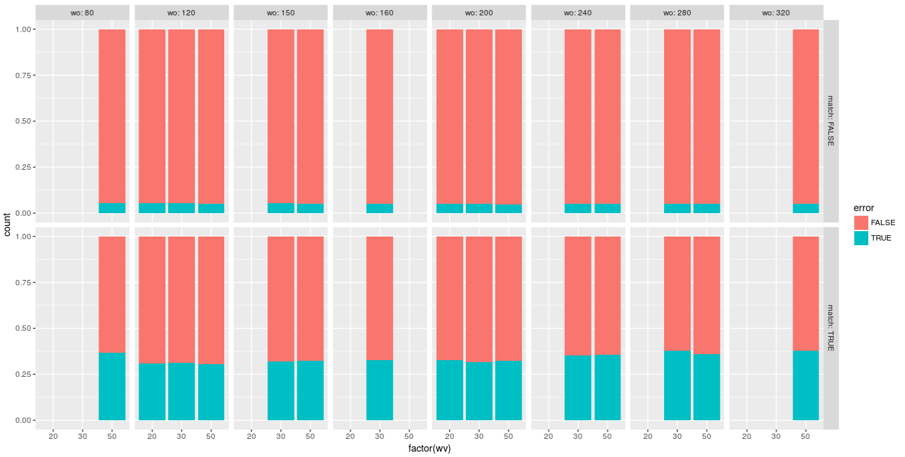
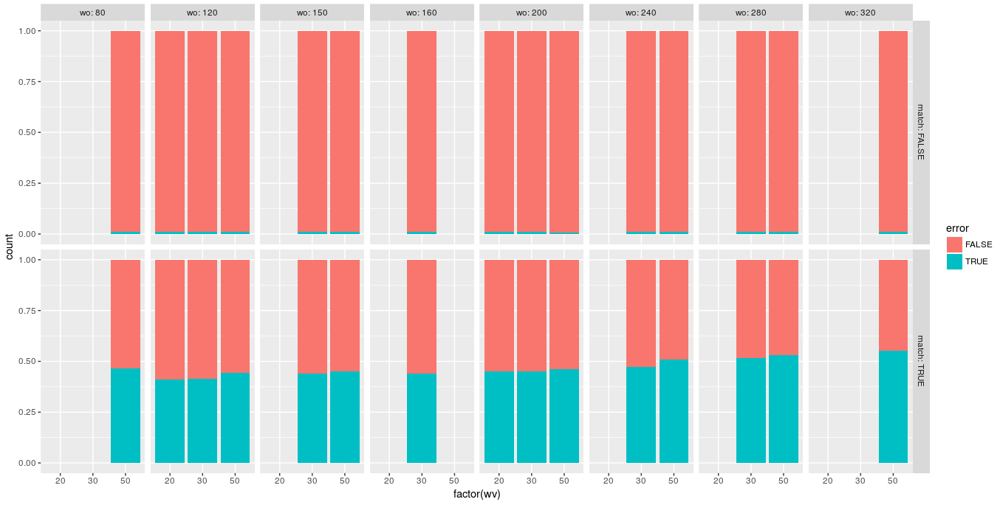
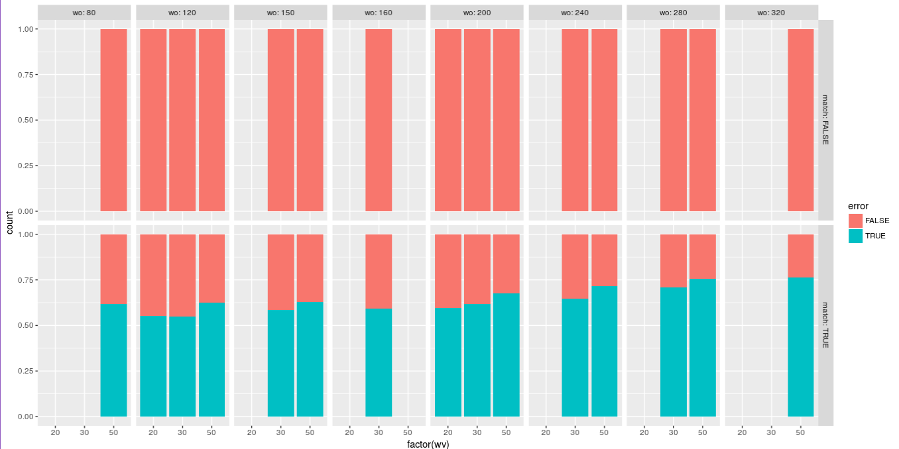
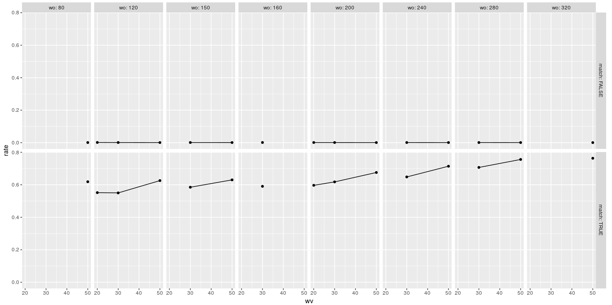

```{r setup, include=FALSE}
knitr::opts_chunk$set(echo = TRUE)
```


## Toolmarks

Used an optimization window size of n = 500 and a validation window size of m = 50. It is visually clear that when the two tool marks match, the U-statistic tends to be relatively large, and when they do not match, the value tends to be relatively small.

The p-Values associated with each U-statistic, are calculated under the assumption that the nonmatch distribution is standard normal. As should be the case, the p-values for nonmatching pairs are approximately uniformly distributed between zero and one, while the p-values for matching pairs are concentrated on small values (suggesting that they would be declared to be “matching”).

The classification rates corresponding to the p-values where the rows correspond to the known status of the tool marks and columns represent the model conclusion. Of 50 pairs of known matching marks, we misclassified three pairs as nonmatches for false-negative error rate of 6% and 0 pairs of known nonmatching tool marks were identified as being matches.

Null Hypothesis: The toolmarks were not made by the same tool.
Alternate: Toolmarks made by the same tool.
```{r cars, echo=FALSE}
a<- matrix(NA, ncol = 3, nrow = 2)
toolmark.falsepositive<- data.frame(a)
colnames(toolmark.falsepositive)<- c("Classification", "Match", "Non-Match")
toolmark.falsepositive$Classification<- c("Match", "Non-Match")
toolmark.falsepositive$Match<- c(47,0)
toolmark.falsepositive$`Non-Match`<- c(3,50)
toolmark.falsepositive

```
## Bullets

Following on similar lines, the first step here is to first identify what difference does different window sizes of optimization and the validation step have, when adapting the toolmark method to bullets.

The marking made on bullets are smaller than toolmarks and is also less wider. The idea is to find out possible areas of error while adapting the score based method proposed for toolmarks.

Bullet signatures being compared at this time are from the Hamby 44 and Hamby 252 data, which have the best set of known-matched and known non-matches.

Bullet signatures are chosen by
1. Filtering out Land_id for Profiles from the Hamby 44 and Hamby 252 data and removing 
all NA values
2. run_id = 3 is chosen, Seems like the signatures generated from this run_id give the closest
match. Different run_id's have some different settings for generating the signatures
(The level of smoothing does not seem to be one of them)

The bullet signatures when generated already included the LOWESS smoothing.
Therefore, the coarseness factor is set to 1 while running the chumbley_non_random()
which generates the same_shift, different_shift, U-Stat and P_value parameters.


WO 320 wv 50
```{r echo=FALSE}
a<- matrix(NA, ncol = 3, nrow = 2)
bullet.falsepositive<- data.frame(a)
colnames(bullet.falsepositive)<- c("Classification", "FALSe", "TRUe")
bullet.falsepositive$Classification<- c("FALSe", "TRUe")
bullet.falsepositive$FALSe<- c(77564,412)
bullet.falsepositive$TRUe<- c(4022,674)
bullet.falsepositive

```
Wo 200 WV 50
```{r echo=FALSE}
bullet.falsepositive$FALSe<- c(78817,383)
bullet.falsepositive$TRUe<- c(4004,798)
bullet.falsepositive

```
Wo 80 wv 50
```{r echo=FALSE}
bullet.falsepositive$FALSe<- c(78817,450)
bullet.falsepositive$TRUe<- c(4680,775)
bullet.falsepositive

```

## Including Plots

For a significance level of 0.05


For a significance level of 0.01



For a significance level of 0.001





Note that the `echo = FALSE` parameter was added to the code chunk to prevent printing of the R code that generated the plot.
